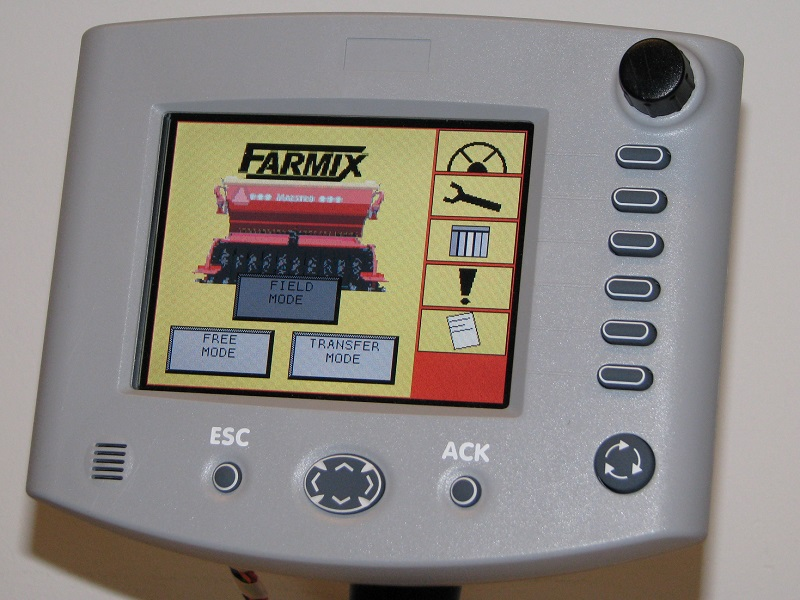
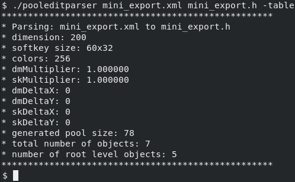

# PoolEditParser

Parser for reading [PoolEdit](https://github.com/moehman/PoolEdit) XML
files and writing binary ISOBUS object pools. This parser is a part of
the implement control application which:

* reads the XML document
* generates the ISO 11783 binary presentation
* and loads it to the virtual terminal.



Because the XML file is parsed at run-time when the VT properties are
known, the PoolEdit parser can resize the GUI objects and reduce the
number of colors accordingly. Another benefit of the XML format is
that it allows the use of symbolic names for referencing the GUI
objects.  The symbolic names are easier to remember than numeric IDs
used in the binary object pool format.



Current development environment:
* OS: Windows 7
* IDE: Dev-C++ 5.11 (2015-04-27)
* Expat: expat-win32bin-2.2.9.exe

Or alternatively:
* OS: Oracle Linux 8 (x86_64)
* Compiler: GCC
* Expat: just say `dnf install expat-devel`

Compiler command to get started:
```
g++ pooleditparser.cxx xml.cxx parser.cxx -o pooleditparser -lexpat -O2 -W -Wall -Wextra -pedantic
```
